# 🚀 AWS Data Processing Pipeline - ITCS 6190 Assignment 3

**Author:** Gaurav Patel  
**Student ID:** 801426641  
**Course:** ITCS 6190 - Cloud Computing for Data Analytics

---

## 📋 Table of Contents

- [Overview](#overview)
- [Architecture](#architecture)
- [Prerequisites](#prerequisites)
- [Implementation Guide](#implementation-guide)
- [Athena Queries](#athena-queries)
- [Results & Dashboard](#results--dashboard)
- [Project Structure](#project-structure)
- [Important Notes](#important-notes)

---

## 🎯 Overview

This project demonstrates an **end-to-end serverless data processing pipeline** on AWS. The pipeline automates the entire data workflow from ingestion to visualization:

1. **Data Ingestion**: Raw CSV files are uploaded to S3
2. **Data Processing**: Lambda function automatically processes and filters data
3. **Data Cataloging**: AWS Glue crawler creates a data catalog
4. **Data Querying**: Amazon Athena enables SQL queries on processed data
5. **Data Visualization**: Dynamic web dashboard hosted on EC2 displays results

### Key Technologies

- **Amazon S3** - Data storage and staging
- **AWS Lambda** - Serverless data processing
- **AWS Glue** - Data cataloging and schema discovery
- **Amazon Athena** - Serverless SQL querying
- **Amazon EC2** - Web server hosting
- **Flask** - Python web framework
- **Boto3** - AWS SDK for Python

---

## 🏗️ Architecture

```
┌─────────────┐
│   Raw CSV   │
│   Upload    │
└──────┬──────┘
       │
       ▼
┌─────────────┐     ┌──────────────┐     ┌─────────────┐
│  S3 Bucket  │────▶│ Lambda Func  │────▶│  Processed  │
│   (raw/)    │     │  (Process)   │     │  Data (S3)  │
└─────────────┘     └──────────────┘     └──────┬──────┘
                                                 │
                                                 ▼
                                          ┌──────────────┐
                                          │ Glue Crawler │
                                          │  (Catalog)   │
                                          └──────┬───────┘
                                                 │
                                                 ▼
                                          ┌──────────────┐
                                          │   Athena     │
                                          │  (Queries)   │
                                          └──────┬───────┘
                                                 │
                                                 ▼
                                          ┌──────────────┐
                                          │  EC2 Server  │
                                          │  (Dashboard) │
                                          └──────────────┘
```

---

## 📦 Prerequisites

- AWS Account with appropriate permissions
- AWS CLI configured (optional, for local development)
- Basic knowledge of AWS services (S3, Lambda, Glue, Athena, EC2)
- SSH client for EC2 access

---

## 🔧 Implementation Guide

### Step 1: Amazon S3 Bucket Structure 🪣

Create an S3 bucket with the following folder structure:

```
bucket-name/
├── raw/          # Incoming raw data files
├── processed/    # Cleaned and filtered data (Lambda output)
└── enriched/     # Athena query results
```

**Screenshot:** 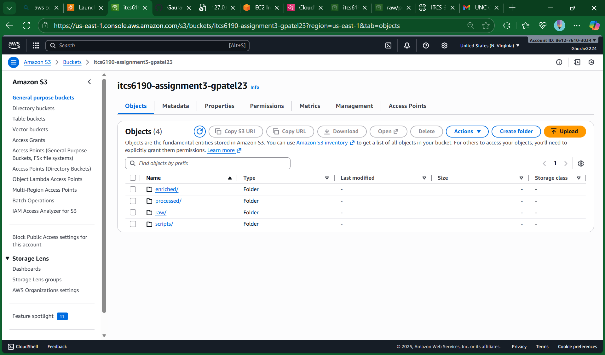

---

### Step 2: IAM Roles and Permissions 🔐

Create three IAM roles with appropriate permissions:

#### 2.1 Lambda Execution Role

- **Trusted Entity**: AWS Service → Lambda
- **Policies**:
  - `AWSLambdaBasicExecutionRole`
  - `AmazonS3FullAccess`
- **Name**: `Lambda-S3-Processing-Role`

**Screenshot:** 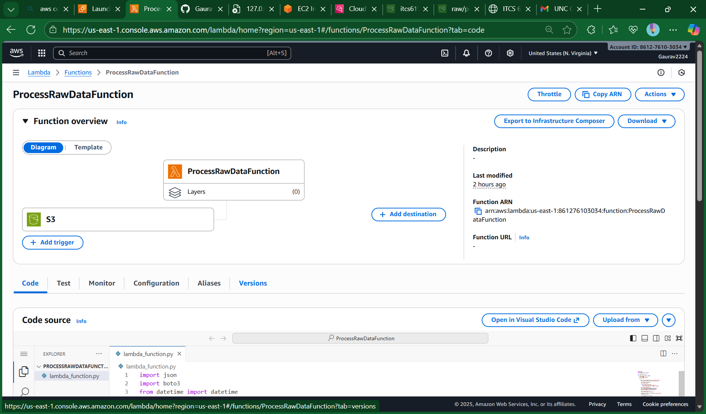

#### 2.2 Glue Service Role

- **Trusted Entity**: AWS Service → Glue
- **Policies**:
  - `AmazonS3FullAccess`
  - `AWSGlueConsoleFullAccess`
  - `AWSGlueServiceRole`
- **Name**: `Glue-S3-Crawler-Role`

**Screenshot:** 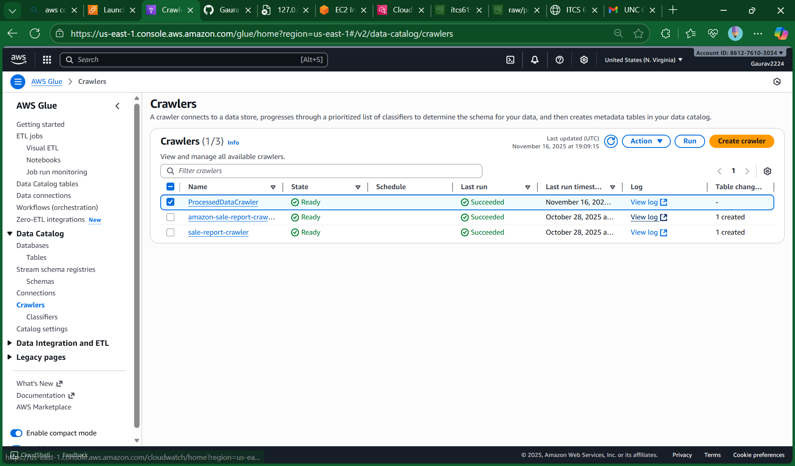

#### 2.3 EC2 Instance Profile

- **Trusted Entity**: AWS Service → EC2
- **Policies**:
  - `AmazonS3FullAccess`
  - `AmazonAthenaFullAccess`
- **Name**: `EC2-Athena-Dashboard-Role`

**Screenshot:** 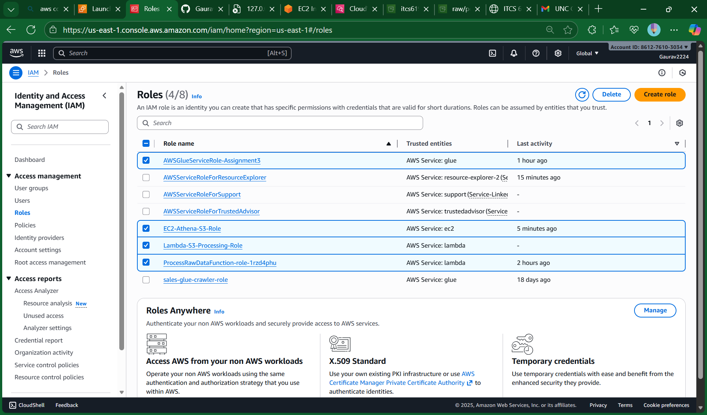

---

### Step 3: Create the Lambda Function ⚙️

1. Navigate to **Lambda** service → **Create function**
2. **Configuration**:
   - **Function name**: `FilterAndProcessOrders`
   - **Runtime**: Python 3.9+ (or newer)
   - **Execution role**: Select `Lambda-S3-Processing-Role`
3. **Code**: Replace default code with `LambdaFunction.py`

**Screenshot:** 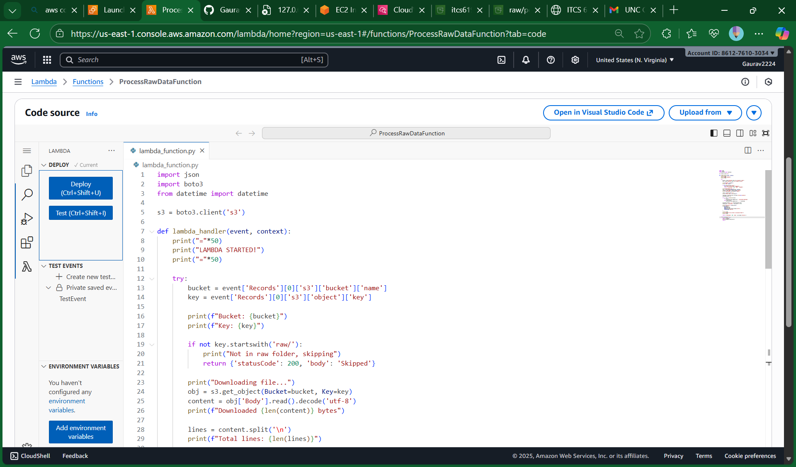

---

### Step 4: Configure the S3 Trigger ⚡

1. In Lambda function → **Add trigger**
2. **Configuration**:
   - **Source**: S3
   - **Bucket**: Your S3 bucket
   - **Event types**: All object create events
   - **Prefix**: `raw/`
   - **Suffix**: `.csv`

**Screenshot:** 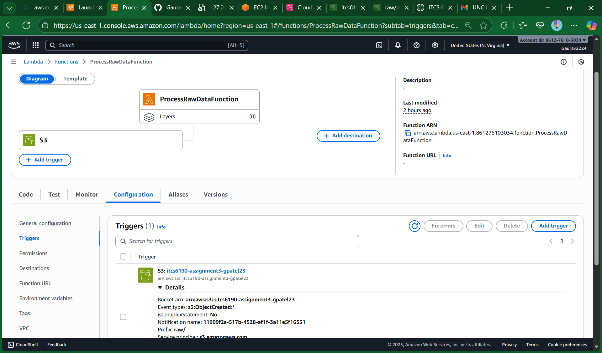

#### 🚀 Start Processing

Upload `orders.csv` to the `raw/` folder in your S3 bucket. This automatically triggers the Lambda function.

**Screenshot:** 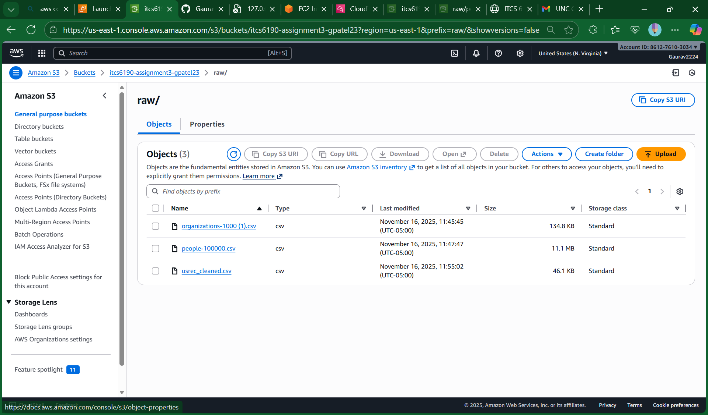

---

### Step 5: Create a Glue Crawler 🕸️

1. Navigate to **AWS Glue** → **Crawlers** → **Create crawler**
2. **Configuration**:
   - **Name**: `orders_processed_crawler`
   - **Data source**: Point to `processed/` folder in S3
   - **IAM Role**: `Glue-S3-Crawler-Role`
   - **Database**: Create new database `orders_db`
3. **Run the crawler** to create the data catalog table

**Screenshot:** 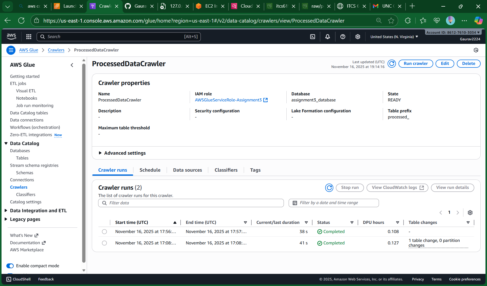

---

### Step 6: Query Data with Amazon Athena 🔍

1. Navigate to **Amazon Athena**
2. Set **Data source**: `AwsDataCatalog`
3. Set **Database**: `orders_db`

**Screenshot:** 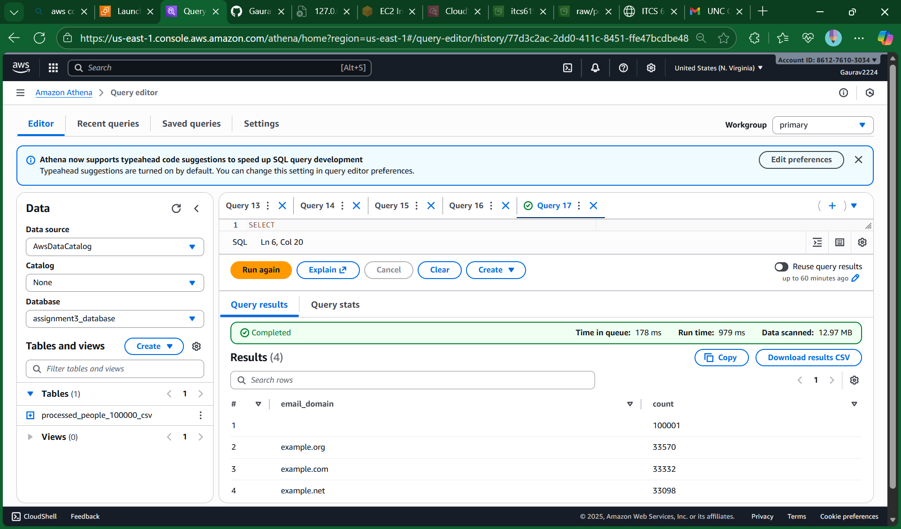

---

### Step 7: Launch the EC2 Web Server 🖥️

1. Navigate to **EC2** → **Launch instance**
2. **Configuration**:
   - **Name**: `Athena-Dashboard-Server`
   - **AMI**: Amazon Linux 2023 AMI
   - **Instance type**: t2.micro (Free tier)
   - **Key pair**: Create and download `.pem` file
   - **Security Group**:
     - **SSH (Port 22)**: My IP
     - **Custom TCP (Port 5000)**: Anywhere (0.0.0.0/0)
   - **IAM instance profile**: `EC2-Athena-Dashboard-Role`

**Screenshot:** 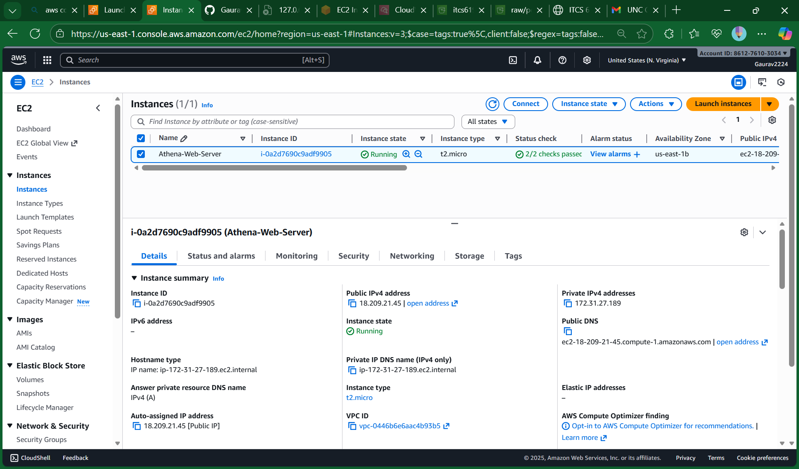

---

### Step 8: Connect to EC2 Instance

```bash
ssh -i /path/to/your-key-file.pem ec2-user@YOUR_PUBLIC_IP_ADDRESS
```

---

### Step 9: Set Up Web Environment

Once connected via SSH, run:

```bash
# Update system packages
sudo yum update -y

# Install Python and Pip
sudo yum install python3-pip -y

# Install required libraries
pip3 install Flask boto3
```

---

### Step 10: Create and Configure Web Application

1. Create the application file:
   ```bash
   nano app.py
   ```

2. Copy code from `EC2InstanceNANOapp.py` into `app.py`

3. **Update configuration variables**:
   ```python
   AWS_REGION = 'us-east-1'  # Your AWS region
   ATHENA_DATABASE = 'orders_db'  # Your Glue database name
   S3_OUTPUT_LOCATION = 's3://your-athena-results-bucket/'  # Athena results location
   ```

4. Save and exit: `Ctrl + X`, then `Y`, then `Enter`

---

### Step 11: Run the App and View Dashboard! 🚀

1. Start the Flask server:
   ```bash
   python3 app.py
   ```

2. Access the dashboard:
   ```
   http://YOUR_PUBLIC_IP_ADDRESS:5000
   ```

**Screenshot:** 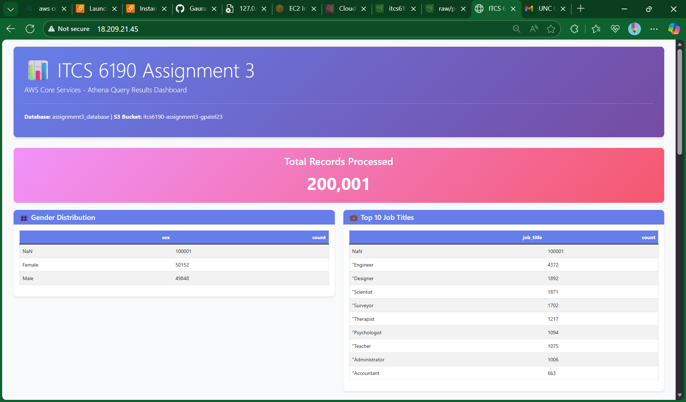

---

## 📊 Athena Queries

The following SQL queries are executed in Amazon Athena and displayed on the dashboard:

### 1. Total Sales by Customer
```sql
SELECT 
    customer_id,
    SUM(order_amount) AS total_sales
FROM orders_processed
GROUP BY customer_id
ORDER BY total_sales DESC;
```

### 2. Monthly Order Volume and Revenue
```sql
SELECT 
    DATE_FORMAT(order_date, '%Y-%m') AS month,
    COUNT(*) AS order_count,
    SUM(order_amount) AS total_revenue
FROM orders_processed
GROUP BY DATE_FORMAT(order_date, '%Y-%m')
ORDER BY month;
```

### 3. Order Status Dashboard
```sql
SELECT 
    order_status,
    COUNT(*) AS order_count,
    SUM(order_amount) AS total_amount
FROM orders_processed
GROUP BY order_status;
```

### 4. Average Order Value (AOV) per Customer
```sql
SELECT 
    customer_id,
    AVG(order_amount) AS average_order_value,
    COUNT(*) AS order_count
FROM orders_processed
GROUP BY customer_id
ORDER BY average_order_value DESC;
```

### 5. Top 10 Largest Orders in February 2025
```sql
SELECT 
    order_id,
    customer_id,
    order_date,
    order_amount,
    order_status
FROM orders_processed
WHERE DATE_FORMAT(order_date, '%Y-%m') = '2025-02'
ORDER BY order_amount DESC
LIMIT 10;
```

---

## 📈 Results & Dashboard

The EC2-hosted dashboard displays all query results in a clean, organized format with:

- **Interactive tables** showing query results
- **Real-time data** fetched from Athena
- **Responsive design** for easy viewing
- **Error handling** for failed queries

**Dashboard Features:**
- Total Sales by Customer visualization
- Monthly revenue trends
- Order status breakdown
- Customer analytics
- Top orders display

---

## 📁 Project Structure

```
ITCS-6190-Assignment-3/
├── README.md                    # This file
├── LambdaFunction.py            # Lambda function code
├── EC2InstanceNANOapp.py       # Flask web application
├── orders.csv                   # Sample input data
├── A3_itcs6190_v4.0.pdf        # Assignment specification
└── implementation_ss/          # Implementation screenshots
    ├── 1.png                   # S3 bucket structure
    ├── 2.png                   # Lambda IAM role
    ├── 3.png                   # Glue IAM role
    ├── 4.png                   # EC2 IAM role
    ├── 5.png                   # Lambda function
    ├── 6.png                   # S3 trigger
    ├── 7.png                   # CSV upload
    ├── 8.png                   # Glue crawler
    ├── 9.png                   # Athena queries
    ├── 10.png                  # EC2 instance
    └── 11.png                  # Dashboard
```

---

## ⚠️ Important Notes

### Cost Management 💰
- This setup uses **free-tier eligible services** (t2.micro EC2, Lambda free tier)
- **Stop or terminate your EC2 instance** when not in use to avoid charges
- Monitor your AWS usage through the AWS Cost Explorer

### Security 🔒
- Keep your `.pem` key file secure and never commit it to the repository
- Use security groups to restrict access to your EC2 instance
- Regularly review IAM roles and permissions

### Stopping the Server 🛑
- To stop the Flask application: Press `Ctrl + C` in the SSH terminal
- To stop the EC2 instance: Use the AWS Console → EC2 → Stop Instance

### Troubleshooting 🔧
- **Lambda not triggering**: Check S3 trigger configuration and IAM permissions
- **Glue crawler fails**: Verify S3 bucket permissions and data format
- **Athena queries fail**: Ensure Glue crawler has completed successfully
- **Dashboard not loading**: Check EC2 security group (port 5000) and Flask app logs

---

## 🎓 Learning Outcomes

This project demonstrates:

- ✅ Serverless architecture design
- ✅ Event-driven data processing
- ✅ AWS service integration (S3, Lambda, Glue, Athena, EC2)
- ✅ IAM role-based access control
- ✅ Data pipeline automation
- ✅ Cloud-based data visualization

---

## 📝 License

This project is part of an academic assignment for ITCS 6190 - Cloud Computing for Data Analytics.

---

## 👤 Author

**Gaurav Patel**  
Student ID: 801426641  
Course: ITCS 6190 - Cloud Computing for Data Analytics

---

## 🙏 Acknowledgments

- AWS Documentation
- ITCS 6190 Course Materials
- Flask and Boto3 Communities

---

<div align="center">

**Built with ❤️ using AWS Serverless Technologies**

[](https://aws.amazon.com/)
[](https://www.python.org/)
[](https://flask.palletsprojects.com/)

</div>

